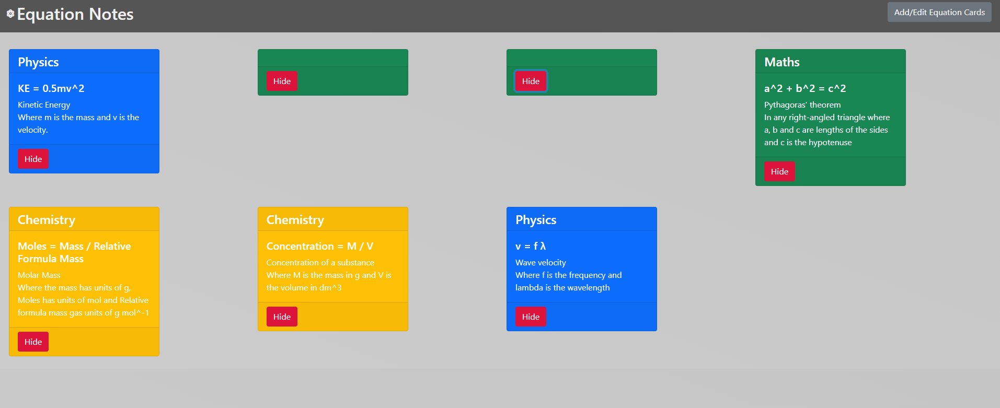

# equationsApp-FrontEnd

This README is for my CRUD (Create, Read, Update, Delete) application that incorporates full stack development, HTML/CSS/JS front end web design and a Java back end with database management with the use of H2 Console for testing and MySQL for production.

This README will outline the project including the planning, research and development.

# Equation Notes App
Below is the contents area for this markdown file.

## Contents
1. [Resources](#Resources)
2. [Brief](#Brief)
3. [Kanban Board](#Kanban-Board)
4. [Database Structure](#Database-Structure)
5. [Data Stack](#Data-Stack)
6. [Testing](#Testing)
7. [Front-end](#Front-end)
8. [Future Improvements](#Future-Improvements)
9. [Author](#Author-and-Acknowledgements)

## Resources
- Presentation *[here](https://docs.google.com/presentation/d/1CeagxNJBdigtUtTTX51lKcb1Qe767bxx41C1KslLVlM/edit#slide=id.gc6384517b1_0_327)*
- Jira Board *[here](https://lbutcherqa.atlassian.net/secure/RapidBoard.jspa?rapidView=5&projectKey=EA&selectedIssue=EA-2)*
- Front-end Github Repo *[here](https://github.com/LButcherQA-BAE11/equationsApp-FrontEnd)*
- Back-end Github Repo *[here](https://github.com/LButcherQA-BAE11/equationsApp)*

## Brief

To create a CRUD application with the utilisation of supporting tools, methodologies and technologies that encapsulate all core modules covered during training shown below:

- Project Management
- Databases
- Java SE
- Spring Boot
- Front-End Development
- Automated Testing

# My Approach

I chose to create a Equations Notes app due to my background in Physics and Maths, its a really simple CRUD application which is made to help the user memorise equations for their subjects.
In order to achieve the CRUD functionality I produced a Equations database which stored equations along with notes. The Equations app allows users to:

- Create equation cards in the database.
- Read all equation cards created and already existing in the database.
- Update existing equation cards in the database.
- Delete any equation cards from the database.

A added extra functionality allows users to hide the Equation Cards to help with user revise their equations.

# Kanban Board

My kanban board for this project can be found [here](https://lbutcherqa.atlassian.net/secure/RapidBoard.jspa?rapidView=5&projectKey=EA&selectedIssue=EA-2).
This board was created using Jira software, it is modelled as a Agile Scrum board to help me manage the project.  
Here are screenshots of my Jira board:

The Jira board contains user stories which cover different aspects of the criteria in the brief, these user stories also drill down into subtasks for the individual tasks needed to complete the criteria.  

User story example:

Upon creation of the subtasks they are placed in the 'To Do' column and subsequently moved from left to right to 'In progress' when doing the task at hand and eventually moved to 'Done' once completed.

# Database Structure

Here is a screenshot of the entity relationship diagram (ERD) for the database used in my project.

# Data Stack

### Database

For this project I used a MySQL relational database used to store data persistently. This database is created or 'dropped' everytime the application is run and returns the full database to the front end for the user to interact with. The schema of this data base is:

DROP TABLE IF EXISTS `equations` CASCADE;
create table equations (id bigint AUTO_INCREMENT,  
description varchar(255),  
 equation varchar(255),  
  equation_name varchar(255),  
   subject varchar(255),  
    primary key (id));  
   
I also configured the project to a local H2 Console database whilst testing the projects Controller and Front End. This allowed a quicker and easier way to test as it allowed me to know exactly what was in the database.

### Back-end

The back-end for this project was built with Java using a Spring Boot Framework allowing for me to easily integrate a structure between the data-base and front-end. This works by having all of the database and HTTP requests in the back-end which allows easy access to the data for the front-end user.

### Front-end

The front-end of this project was built with HTML, CSS and JavaScript. I also used Bootstrap to easily create well formatted cards for displaying the data. The styling is done by the HTML and CSS and retrieves data from the use of JavaScript utilising DOM manipulation to create, read, update and delete data (cards).

# Testing

The total test coverage of the project is 86.2%. Please see the below screenshot:

I perfomed 3 different types of tests for my project. The back-end was tested through integration testing using JUnit and unit testing using Mockito. 
  
  The integration tests perform mock HTTP requests using mockMVC and tests the majority of the functionality of the back end using the H2 database and compares the what the mockMVC HTTP requests return to the expected result along with the body. We used the H2 Database for this as we know exactly what data is stored in there and after each run the database is recreated with our initial row of data.  The unit testing used Mockito which mocks up a repo to allow us to tests the methods on their own.   
    
The front-end was tested using Selenium tests. Selenoum tests the front-ends CRUD functionality in the chrome browser . It also uses the H2 Database and mocks a user using the front-end and checks the DOM for the specific alerts to see if the functionality is working.

# Front-end

The front-end of my project displays a colourful and simple UI which is easy to use. It is designed to clearly display the CRUD functionality of the application.      
 The main page has a sticky header at the top containing the mock up logo designed by myself and a button to the 'Revise' page, under the header we have the form with a reset and add button at the bottom where the user can create cards/data which will be stored in the database.  
 
  Below the form we also have the existing cards/data in the database, these are colour coded depending on the subject of the equation (e.g Physics is blue and Maths is green). Each of these cards have a update and delete button on the bottom, allowing the user to easily delete or update the card. On updating a card a modal pops up with a form pre populated with values for the user to edit and on submittion of the modal the card will be updated.
    
  The added extra functionality of the revise page is yet to be fully completed. However, on this page the format is very similar to the main page minus the form and buttons. Instead each card has a Hide button which hides the card when clicked allowing the user to have a memorisation test for the equations. I eventually would like to finish off this aspect of the application as well introducting more functionality.

# Future Improvements

Here are some of the improvements which would be great to implement into the app:

- Add a filter by subject, which returns and displays the relevant cards from the database.

- Allow the user to colour code their subjects.

- Add search functionality to search for specific equations.

- Implement a landing page.

- Implement a unhide button in the Revision section of the application.

- Add in a drop down on the form for greek letters, powers and other equation related texts.

# Author and Acknowledgements

I'd like to acknowledge the QA Trainers for helping me complete this project.

Project by Lewis Butcher

